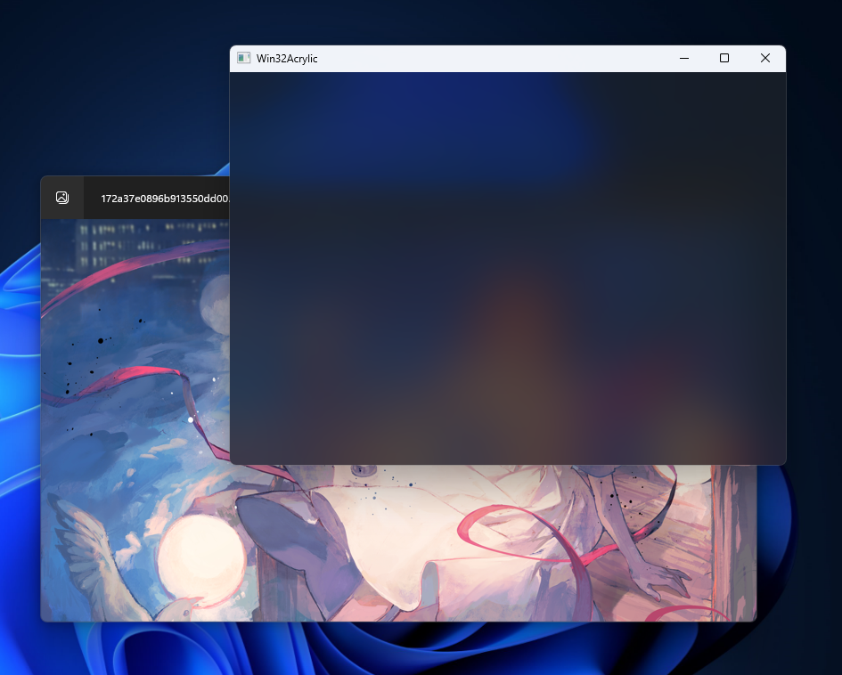
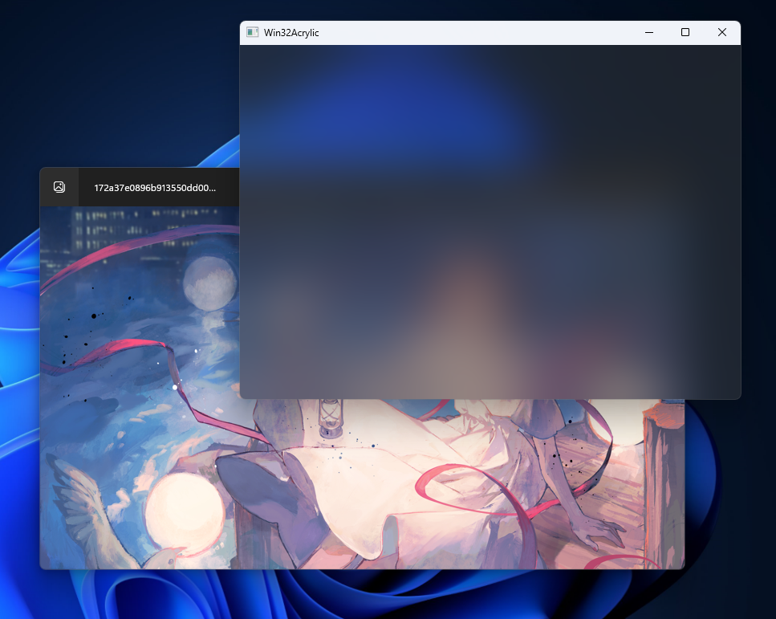
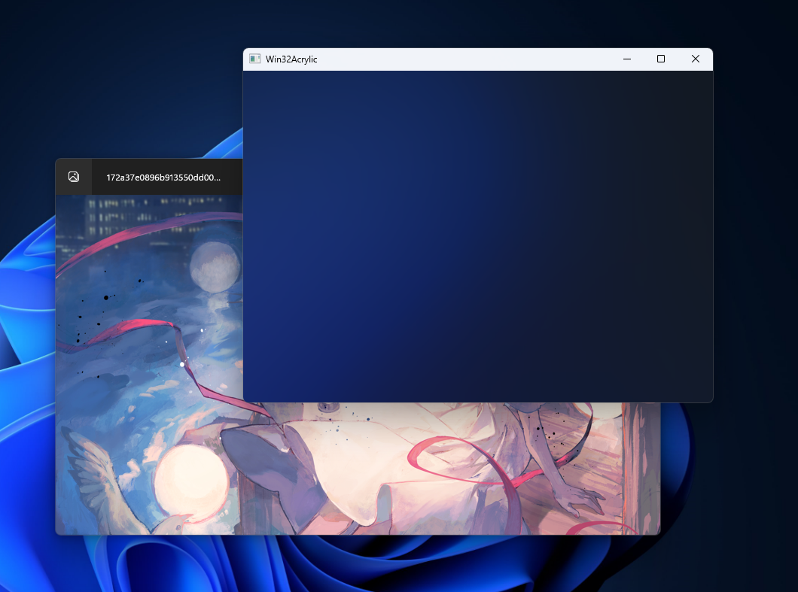

# Win32Acrylic
Using WinRT API to get standard Acrylic Blur or Mica WITHOUT Win2D and WinRT Projection Library.  
This sample included two Acrylic Blur Recipes which are targeted for different version of Windows, and one Mica recipe.  
All of them come from the repo microsoft-ui-xaml.
# Preview



# Customizability
- [x] Blur Amount
- [x] Saturation
- [x] Noise Texture (here we use shared noice texture from Windows.UI.Xaml.Controls.dll)
- [x] Noise Opacity
- [x] Tint Color
- [x] Luminosity Color
# Remarks
During the maximized animation, the effect will temporarily unavailable, it can be solved by using HostbackdropBrush.    
To use HostBackdropBrush, you need to call DwmSetWindowAttribute and pass DWMWA_USE_HOSTBACKDROPBRUSH. (This parameter is available since Windows 11)   
For Windows 10, you need to call SetWindowCompositionAttribute which is an undocumented API like this...  
```C++
auto EnableBackdropSupport(HWND hwnd, bool bEnable)
{
	struct ACCENT_POLICY
	{
		DWORD AccentState;
		DWORD AccentFlags;
		DWORD GradientColor;
		DWORD AnimationId;
	};
	struct WINDOWCOMPOSITIONATTRIBDATA
	{
		DWORD Attrib;
		PVOID pvData;
		SIZE_T cbData;
	};

	ACCENT_POLICY policy = {static_cast<DWORD>(bEnable ? 5 : 0), 0, 0, 0};
	WINDOWCOMPOSITIONATTRIBDATA data = {static_cast<DWORD>(19), &policy, sizeof(ACCENT_POLICY)};
	static const auto& SetWindowCompositionAttribute = (BOOL(WINAPI*)(HWND, PVOID))GetProcAddress(GetModuleHandle(L"User32"), "SetWindowCompositionAttribute");

	return SetWindowCompositionAttribute(hwnd, &data);
}
```
The difference between HostbackdropBrush and BackdropBrush is that BackdropBrush samples the area behind the visual and directly rendered to the screen, but HostbackdropBrush samples the area behind the window to which the composition target of target visual belongs and rendered it to the redirection surface so we can see the content in a Dwm thumbnail.
